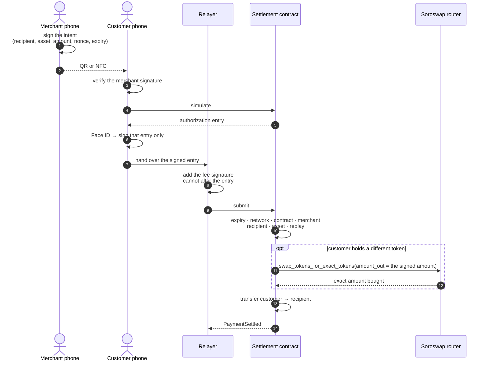
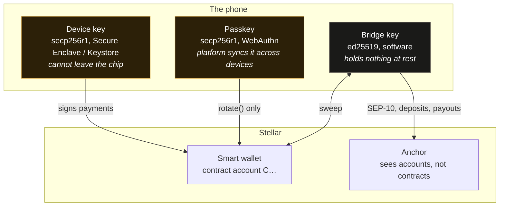
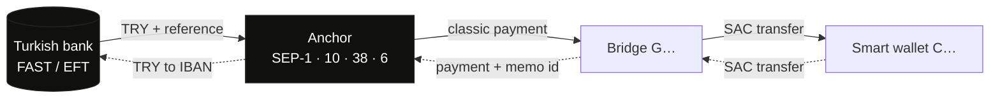
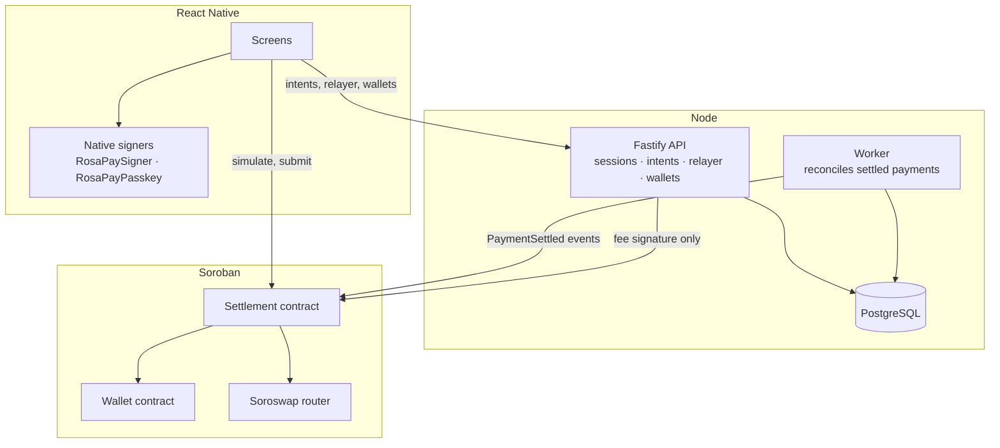

# Architecture

Four diagrams, each answering a question the prose takes a page to answer.

## 1. Who is allowed to do what

The whole design is one idea: **three parties sign three different things, and no
one of them can do another's job.** The merchant says what is owed. The customer
says they will pay it. The relayer pays the network fee and submits. The contract
is the only thing that decides whether any of it happened.

A compromised relayer can refuse to submit. It cannot change the recipient, the
asset, the amount, or who pays — those are inside a signature it does not hold.

## 2. Where the keys live, and why there are three

A Stellar classic account signs ed25519, and no Secure Enclave will hold an
ed25519 key. That single fact produces everything below.

The device key is safest and dies with the handset. The passkey is equally
unreachable but the platform replicates it, so it is the recovery signer — and
the contract restricts a key that is *only* the recovery signer to `rotate`, so
it can rescue the wallet and never spend from it. The bridge key is the one piece
of software-held key material, and it is deliberately worthless: it is not backed
up, and a lost one is replaced.

## 3. Lira in, lira out

The anchor cannot see a contract account: it authenticates accounts, refuses a
contract address as a destination, and matches withdrawals from a payments stream
that a contract transfer never appears in. So money passes through the bridge and
never rests there.

Solid is money in, dotted is money out. **A deposit is not settled while it is
still on the bridge**, whatever the anchor calls the transfer — the same rule as
a claimable balance, and for the same reason.

## 4. What runs where

The API never holds a signing key that can spend a customer's money. It holds the
relayer key, which pays fees, and the admin key, which registers merchants and
assets. Both are useless for moving someone else's balance.

## Verifying these

Every path above has a script that runs it against the live network and asserts
the claims rather than printing them:

| | |
|---|---|
| `npm run testnet:relayed` | the three-signature separation in diagram 1 |
| `npm run testnet:swap` | the Soroswap branch, 17 assertions |
| `npm run testnet:passkey` | the passkey signer in diagram 2, and four refusals |
| `npm run testnet:recovery` | `rotate` from a lost phone, and that recovery cannot spend |
| `npm run testnet:bridge` | both directions of diagram 3 |
| `npm run testnet:try-ramp` | the same rails from a classic account |
